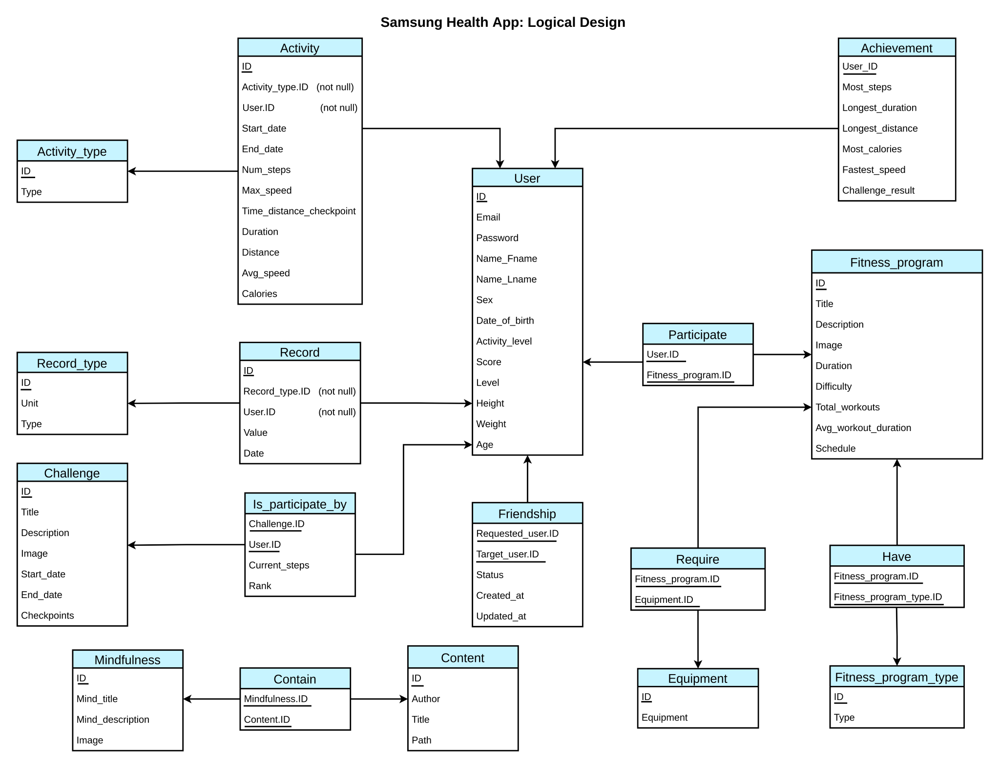

# Database Design for Samsung Health

**Database Design** for an existing application called [Samsung Health](https://www.samsung.com/global/galaxy/apps/samsung-health/). It is developed for term project from the Database Application and Design course (Spring 2021) at Inha University in Tashkent. This application design supposed to implement only **core features** of the existing one, like:

* Recording different kinds of health-related data, like weight, sleep, food

* Recording a variety of fitness activities, like running, cycling, walking with complete details

* Storing user information alongside his/her achievements, scores, and level

* Having friends and storing the list of them

* Offering various global challenges and allowing users to participate

* Recording fitness programs details and allowing a user to participate

* Offering meditation tools, like music, sleep stories, different sessions

You can find a complete **Report** from [here](DB-Report.pdf).

Here is the **Logical Schema** of the application

You can also import [DDL file](Team24_DDL.sql) with [some test data (DML)](Team24_DML.sql) in order to test some queries
